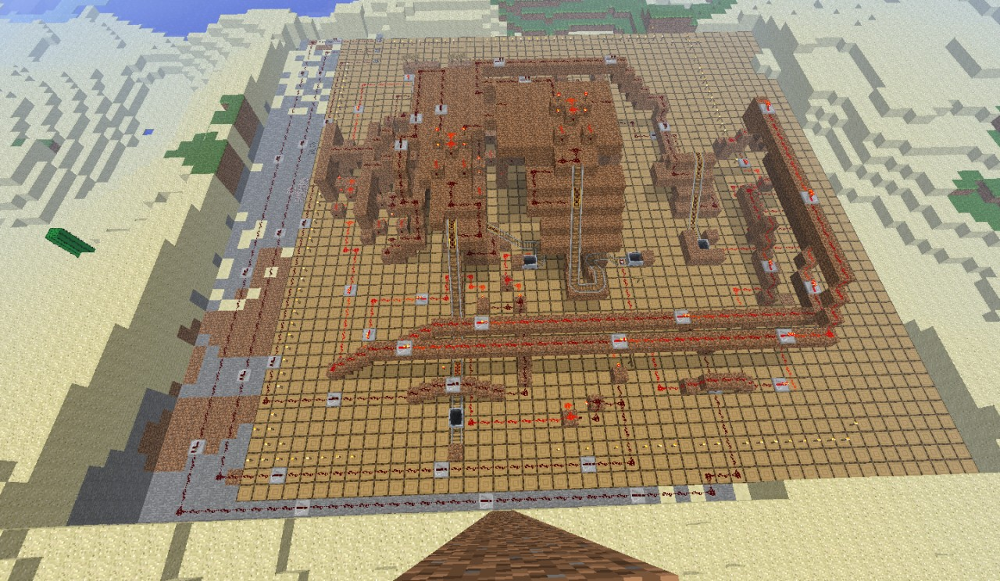

## Minecart Calculator

https://www.youtube.com/watch?v=Erd0ZOB2Rn8

This is a 4-cit calculator that runs more on minecarts rather than redstone logic. The minecarts are used for the logic gates rather than the average redstone gates. I believe it works, but there may be a few bugs that I will work out.

It uses only about 80% minecarts for the logic. I'll see if I wish to update it to 100%. Also, if you are going to use the calculator, please realize the outputs are to the far left of the inputs. To do input, first make sure all minecarts are at the right place (At the top of their rails on the power-rails), and turn the refreshers on then off. Then you may put in your input. For input, I suggest putting the ones on the right first, than the left. You will have about a 5 second window to do it all, or it will send the minecarts off at the wrong time, and it will give you an incorrect answer.

UPDATE: In this calculator, I fixed all the bugs. The old schematic, I believe, is not correct 100%, so I'll update a new schematic that actually works so people can actually play with it and whatnot. If you don't want to update to a new schematic, the only bug is that in the fourth XOR gate on the first floor, if you go to the end of the tunnel, I forgot two redstone torches on the last two blocks. Put them there, and it will work :P

https://www.planetminecraft.com/project/minecart-calculator/
