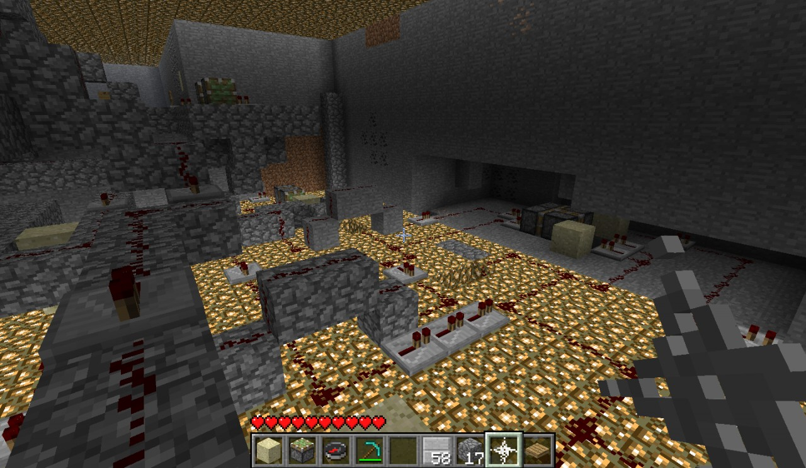

## Piston Calculator

https://www.youtube.com/watch?v=izGG8s-mIzs

This is a 4-bit calculator I made with only pistons,preassureplates,redstone wire, and diodes. There are no redstone torches involved whatsoever, and I invented all the logic gates myself.

https://www.planetminecraft.com/project/piston-calculator/
